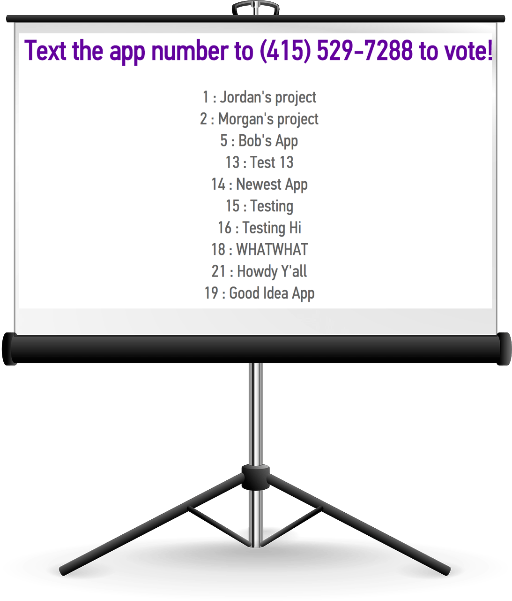
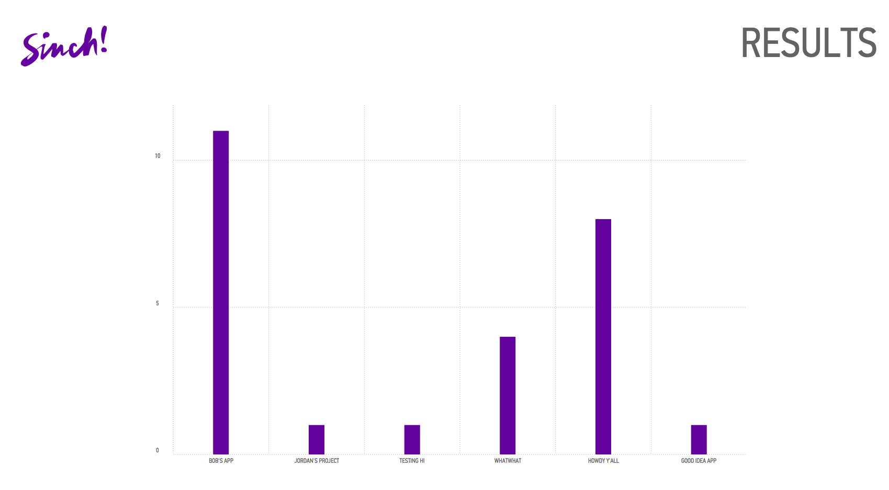
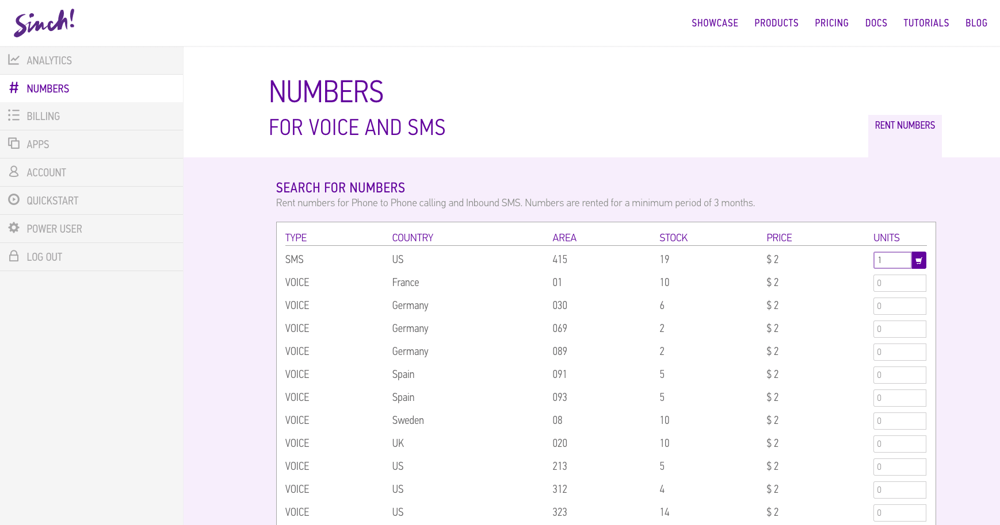
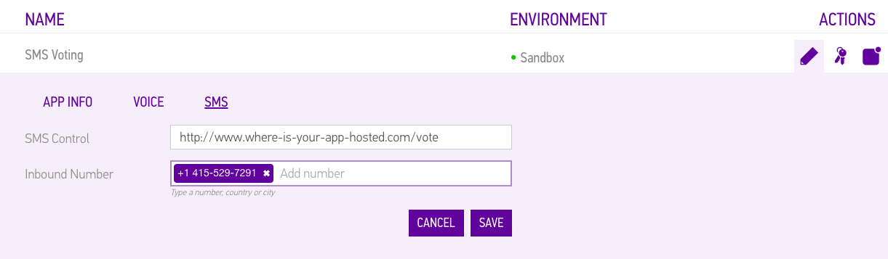

#Build an SMS Voting System (Rails + Sinch + Chartist)

We are hosting an app pitch night, and I wanted an easy way for attendees to vote on their favorite app. I settled on a web app that will display a list of submissions with a corresponding "app number" that attendees can text to a phone number to place their vote. For the purposes of our app festival (only a few minutes to vote, everyone physically present), using SMS to vote takes care of people trying to submit multiple votes, but doesn't force anyone to sign up for an account to vote. As the presentations are happening, I will be entering each app's name into the system via a simple form. When it's time to vote, I can put the list of submissions on the giant projector (please don't judge my photo-editing skills):

Once the voting period is over, I'll navigate to the results page, which shows how many votes each app got:

In the next two sections, I'll go into details about handling the incoming SMS as a vote, and display the results as a graph. The rest of the app is a basic rails app. You can find the finished source code for my app on our Github at [github.com/sinch/rails-sms-voting](https://github.com/sinch/rails-sms-voting)

##Handle Incoming SMS

1. Sign up for a Sinch developer account [sinch.com/signup](https://www.sinch.com/signup)
2. When prompted, verify your mobile phone number to get $2 for free
3. Use the $2 to rent an SMS phone number

4. Create a new app in the developer portal [sinch.com/dashboard/#/apps](https://www.sinch.com/dashboard/#/apps)
5. Edit the SMS callback URL for that app (can't be a local server). This url should accept post requests.

6. Add the phone number that you just rented as "inbound number." At the time of writing this, you can't copy and paste the number. Instead, start typing the area code of the number, and click the number on the dropdown list. If it turned into a purple button like you see above, you did it right.
7. Click the save button **twice!**

Now, you'll want to set up [http://www.where-is-your-app-hosted.com/vote](http://www.where-is-your-app-hosted.com/vote) to do something with the incoming SMS. The post data will look like this:
    
    {
        "event": "incomingSms",
        "to": {
            "type": "number",
            "endpoint": "+46700000000"
        },
        "from": {
            "type": "number",
            "endpoint": "+46700000001"
        },
        "message": "Hello world",
        "timestamp": "2014-12-01T12:00:00Z",
        "version": 1
    }

In my app, I use this data to create a vote object that consists of the message and the from number:

    pick = params["message"]
    from = params["from"]["endpoint"]
    
    #make sure their vote correlates to a submission number
    submission_exists = Submission.where(identifier: pick).length > 0
    
    if submission_exists
    	v = Vote.new
    	v.pick = pick
    	v.from = from
    	v.save
    end
    
    #you can do something fancier here
    render nothing: true
    
    
I'll also mention that rails automatically denies post requests from other domains, so you have to add the following in your controller to allow cross-domain requests to accept the post request from Sinch:

    skip_before_action :verify_authenticity_token, only: [:vote]

##Display Results as a graph

I chose to use the [Chartist.js](http://gionkunz.github.io/chartist-js/) library to display the results as a bar graph. If you think that's boring, it also has nice pie and donut graphs with more interesting colors! To start using, include the **chartist.js**, **chartist.scss**, and **settings/_chartist-settings.scss** files in your project. This is all it takes to make a basic chart:

    <!-- apparently "golden-section" is a popular aspect ratio name! -->
    

    
    
And here's what mine looks like to get data from my backend, only display the y-axis displays if they are integers, and make the bars 30px wide and purple:

    $(function() {
    	$.get('/votes', function(data) {
    		options = {
    			axisY: {
    				labelInterpolationFnc: function (value) {
    	    			return value === Math.floor(value) ? value : null;
    				}
    			}
    		};
    		new Chartist.Bar('.ct-chart', data, options).on('draw', function(drawData) {
    			if(drawData.type === 'bar') {
    				drawData.element.attr({
    				  	style: 'stroke-width: 30px; stroke: RGB(99,2,157);'
    				});
    			};
    		});
    	});
    });
    
For more customization options, check out [Chartist.js docs](http://gionkunz.github.io/chartist-js/api-documentation.html).    
    
    
    
    
    